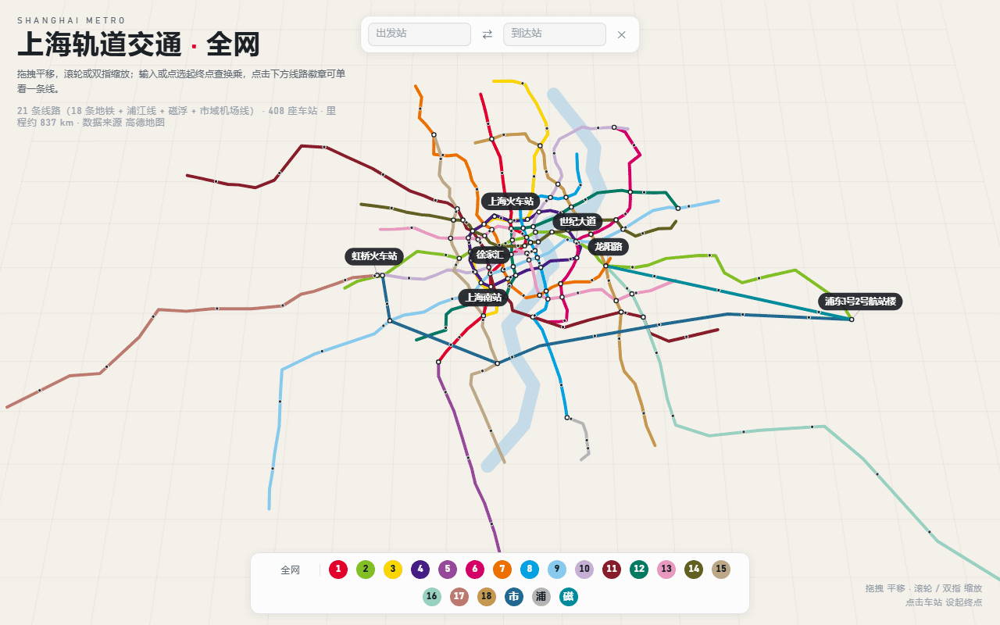

# 上海轨道交通 · 全网 3D

在线体验：**https://shmetro3d.com**（备用地址 [GitHub Pages](https://jrchen2026.github.io/shanghai-subway-3d/)）

一个零依赖单文件的上海地铁换乘查询工具。用 Canvas 2D 画出带轻微俯视倾角的轻量 3D 地铁网络，核心是**查询优先**——点两个站，自动算出耗时最短的换乘路径。



## 功能

- **换乘路径查询**：输入站名（候选面板过滤）或直接在图上点选起终点，Dijkstra 计算最少换乘/最短耗时路径，路径高亮 + 换乘站扩散动画 + 分步卡片
- **真实耗时模型**：区间按线路类型（地铁 38km/h、市域机场线 110km/h、磁浮 200km/h）测速，每站停靠 1 分钟，换乘惩罚 7 分钟，已用实测数据校准（彭浦新村→一大会址·黄陂南路 ≈ 25 分钟）
- **出站换乘标注**：上海火车站、南京西路、长清路、虹桥2号航站楼等几个官方口径仍需出站换乘的站点，用专属耗时替代统一换乘惩罚，图上橙色 ⚠ 标出
- **重点站分层**：按缩放级别分层显示站名，避免全网视野下文字堆叠
- **线路配色**：21 条线路（18 条地铁 + 浦江线 + 磁浮 + 市域机场线）均采用 [rmg-palette](https://github.com/railmapgen/rmg-palette) 官方色值，不做人工调色
- **移动端适配**：竖屏布局、候选面板防 iOS 聚焦缩放、手机端列车动画静态化

## 数据

约 408 座车站（物理站点去重口径），数据截至 2025 年底，来源高德地图 + 官方线路资料校对。13 号线西延 5 站因尚未通车暂未收录。

## 技术

纯前端单文件（`index.html`），无构建、无框架、无第三方依赖，Canvas 2D 手写渲染 + 相机投影，直接用浏览器打开或挂静态托管即可运行。

## 本地运行

```
npx http-server .
```

## 部署

托管在 Cloudflare Workers（静态资源模式，见 `wrangler.jsonc`），推送到 `master` 分支自动构建发布。

## 已知限制

- 安卓机型/浏览器兼容性尚未大范围验证，欢迎反馈机型 + 浏览器 + 问题截图
- 5 号线"闵行开发区支线"为 Y 形分叉，现有单线性数据结构暂未建模
- 手机端部分点击目标（约 36-39px）略小于 44px 触控标准
